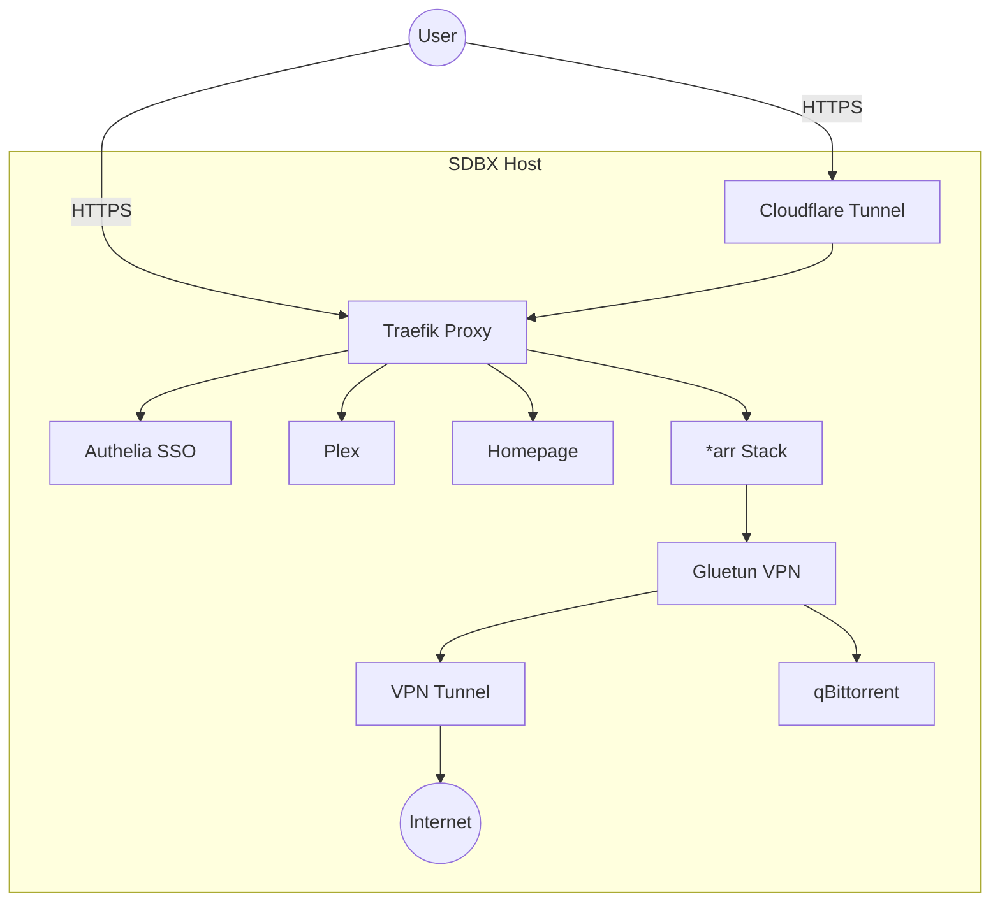

# SDBX — Seedbox in a Box 📦✨

[](LICENSE)
[](https://go.dev)
[](https://docs.docker.com/compose/)
[](https://github.com/maiko/sdbx/releases/latest)
[](https://github.com/maiko/sdbx/actions)
[](https://github.com/maiko/sdbx)

A production-ready, **security-first** seedbox automation stack for collecting, organizing, and streaming **legal media**.

> [!CAUTION]
> **This software is NOT designed to circumvent any laws.** Only use sources, indexers, and content that you have the legal right to download and distribute.

## ✨ Features

- **🧙‍♂️ Interactive Wizard** — Beautiful TUI to bootstrap your project in seconds
- **🔐 Auth Everywhere** — Authelia SSO protecting **all** services (1FA default, opt-in 2FA)
- **🌐 VPN-Enforced Downloads** — Route torrents through Gluetun (NordVPN, ProtonVPN, PIA, Mullvad, etc) with automatic kill-switch
- **🚀 Smart Exposure Mode**
  - **`cloudflared`** — Zero Ingress Trust (No open ports, Cloudflare Tunnel) 🛡️
  - **`direct`** — Standard Reverse Proxy (Traefik + Let's Encrypt) 🌐
  - **`lan`** — Local Network Mode (HTTP only, great for existing proxies) 🏠
- **🔀 Flexible Routing Strategies**
  - **Subdomain**: `radarr.domain.tld`, `sonarr.domain.tld` (Clean & classic)
  - **Path-Based**: `sdbx.domain.tld/radarr`, `sdbx.domain.tld/sonarr` (Single generic certificate)
- **📺 Multimedia Stack** — Full *arr suite (Sonarr, Radarr, Prowlarr) + Plex/Overseerr/Wizarr/Tautulli
- **📊 Modern Dashboard** — Homepage portal with live service status and widgets
- **🔄 Smart Updates** — Managed via Watchtower with health checks and rollbacks
- **🛠️ Built-in Diagnostics** — Integrated `doctor` command to keep your stack healthy

## 🏗️ Architecture



## 📋 Prerequisites

- **OS**: Linux (Debian/Ubuntu) or macOS (Intel/Apple Silicon)
- **Docker**: Engine 24.0+ & Compose v2
- **Domain**: A registered domain (e.g., `box.sdbx.one`)
- **VPN**: Optional (Supported: NordVPN, ProtonVPN, PIA, Mullvad, Surfshark, Custom)

## 🚀 Quick Start

### 1. Install

```bash
# Automated installation (recommended)
curl -fsSL https://raw.githubusercontent.com/maiko/SDBX/main/install.sh | bash

# Or manual installation
# Visit https://github.com/maiko/SDBX/releases/latest to download for your platform
# Example for Linux amd64:
curl -LO https://github.com/maiko/SDBX/releases/latest/download/sdbx_linux_amd64.tar.gz
tar -xzf sdbx_linux_amd64.tar.gz
sudo mv sdbx /usr/local/bin/
sudo chmod +x /usr/local/bin/sdbx

# Verify installation
sdbx version
```

### 2. Initialize

Run the magical wizard to setup your stack:

```bash
mkdir ~/seedbox && cd ~/seedbox
sdbx init
```

The wizard will guide you through:
- **Domain Setup**
- **Exposure Mode** (Cloudflare Tunnel / Direct / LAN)
- **Routing Strategy** (Subdomain / Path)
- **VPN Configuration**
- **Admin User Creation**

### 3. Deploy

```bash
sdbx up
```

### 4. Verify

```bash
sdbx doctor        # 🩺 Check connectivity & config health
sdbx status        # 📊 View active services & ports
sdbx open          # 🌐 Launch dashboard in browser
```

### 5. First Login

Access your dashboard at `https://home.yourdomain.com` (or `https://yourdomain.com` if using path routing).

**Credentials:**
Use the **Admin Username** and **Password** you configured during `sdbx init`.

> [!TIP]
> **Forgot your password?**
> Generate a new hash:
> `docker run --rm authelia/authelia:latest authelia crypto hash generate argon2 --password "newpassword"`
> And update `configs/authelia/users_database.yml`

## 📚 Documentation

Dive deeper into the SDBX ecosystem:

### Getting Started
- [🚀 Getting Started](docs/getting-started.md) — Comprehensive guide for new users
- [📦 Post-Deployment Guide](docs/post-deployment.md) — Configure services after installation
- [❓ FAQ](docs/faq.md) — Frequently asked questions

### Reference
- [🕹️ CLI Reference](docs/cli-reference.md) — Documentation for every `sdbx` command
- [🏗️ Architecture](docs/architecture.md) — Understanding the network and service flow
- [🧩 Addons](docs/addons.md) — Expanding your stack with optional services

### Maintenance
- [🩺 Troubleshooting](docs/troubleshooting.md) — When things don't go as planned
- [🔄 Migration Guide](docs/migration.md) — Upgrading and migrating from other solutions
- [🤝 Contributing](CONTRIBUTING.md) — Help improve SDBX
- [🔒 Security](SECURITY.md) — Security policy and best practices

## 📖 CLI Reference

### Core Commands

| Command | Description |
|---------|-------------|
| `sdbx init` | Bootstrap a new project with interactive wizard |
| `sdbx up` | Start all services in detached mode |
| `sdbx down` | Stop all services gracefully |
| `sdbx restart [service]` | Restart one or all services |
| `sdbx status` | View service health, ports, and versions |
| `sdbx logs [service]` | Stream logs from services |
| `sdbx doctor` | Run comprehensive diagnostic checks |
| `sdbx version` | Display version information |

### Configuration & Secrets

| Command | Description |
|---------|-------------|
| `sdbx config get [key]` | View configuration values |
| `sdbx config set <key> <value>` | Update configuration |

**Note**: Secrets are auto-generated during `sdbx init` and stored in `secrets/` directory. To rotate manually, delete secret files and restart services.

### Addon & Source Management

| Command | Description |
|---------|-------------|
| `sdbx addon list [--all]` | Show available and enabled addons |
| `sdbx addon search <query>` | Search for addons by name or category |
| `sdbx addon info <name>` | Display detailed addon information |
| `sdbx addon enable <name>` | Enable an optional addon |
| `sdbx addon disable <name>` | Disable an addon |
| `sdbx source list` | List configured service sources |
| `sdbx source add <name> <url>` | Add a Git source (like Homebrew taps) |
| `sdbx source remove <name>` | Remove a source |
| `sdbx source update [name]` | Update source(s) from remote |

### Lock File Management

| Command | Description |
|---------|-------------|
| `sdbx lock` | Generate/update lock file |
| `sdbx lock verify` | Verify lock file integrity |
| `sdbx lock diff` | Show differences from lock |
| `sdbx lock update [service]` | Update specific service in lock |

### Maintenance

| Command | Description |
|---------|-------------|
| `sdbx update` | Update service Docker images |
| `sdbx backup run` | Create a backup of configuration |
| `sdbx backup list` | List available backups |
| `sdbx backup restore <file>` | Restore from backup |
| `sdbx open [service]` | Open service URL in browser |

## 🔧 Configuration

### Environment Variables

All configuration is managed via `.env` (generated by `init`):

```bash
# Core
SDBX_DOMAIN=box.sdbx.one
SDBX_EXPOSE_MODE=cloudflared    # cloudflared, direct, lan
SDBX_ROUTING_STRATEGY=subdomain # subdomain, path
SDBX_TIMEZONE=Europe/Paris

# Storage
SDBX_MEDIA_PATH=/srv/media
SDBX_CONFIG_PATH=/srv/sdbx

# VPN (Gluetun)
SDBX_VPN_PROVIDER=nordvpn
# Credentials stored in secrets/*.txt
```

### Addons

Supercharge your stack with optional modules:

```bash
sdbx addon enable overseerr    # 🎬 Request management (Requests -> Sonarr/Radarr)
sdbx addon enable wizarr       # 🤝 Invite users to Plex easily
sdbx addon enable tautulli     # 📊 Plex usage analytics
sdbx addon enable lidarr       # 🎵 Music collection manager
sdbx addon enable readarr      # 📚 Books/Audiobooks manager
sdbx addon enable bazarr       # 🗣️ Subtitle manager
```

## 🔒 Security

SDBX is **secure by default**:
- **Zero Trust** via Cloudflare Tunnel (optional)
- **SSO Authentication** for *all* services via Authelia
- **Rate Limiting** & **Security Headers** pre-configured on Traefik
- **VPN Kill-Switch** for all download traffic
- **Secrets Management** (no passwords in `compose.yaml`)

## 🤝 Contributing

Contributions are welcome! Please read our [Contributing Guide](CONTRIBUTING.md) before submitting PRs.

## 📄 License

This project is licensed under the MIT License — see the [LICENSE](LICENSE) file for details.

## ⚠️ Disclaimer

This software is provided for **legal use only**. The maintainers are not responsible for any misuse. Always ensure you have the right to download and distribute any content you handle with this stack.

