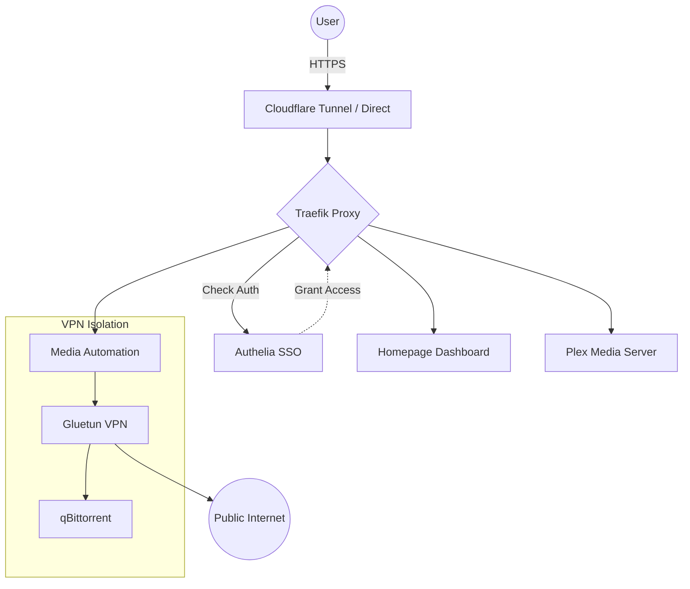

# Architecture & Networking 🏗️

Understanding how SDBX components communicate is key to managing and customizing your stack.

## 🧱 The Core Components

SDBX is composed of several architectural layers:

### 1. The Gateway Layer
- **Traefik Proxy**: The brain of the networking. It handles TLS termination, routing, and connects to Authelia for middleware-based authentication.
- **Cloudflared (Optional)**: Creates a secure tunnel between your server and Cloudflare, allowing exposure without opening ports on your router.
- **Authelia SSO**: Provides a centralized login for all services. Once logged in, you can access any service without re-entering credentials.

## 🌍 Exposure Modes

SDBX supports three exposure modes to fit different deployment scenarios:

| Mode | Ports | TLS | Use Case |
|------|-------|-----|----------|
| `cloudflared` | None | Via Cloudflare | Production, zero open ports |
| `direct` | 80, 443 | Let's Encrypt / Custom | VPS with public IP |
| `lan` | 80 | None | Home lab behind reverse proxy |

## 🔀 Routing Strategies

Services can be accessed via two routing patterns:

### Subdomain Routing (Default)
Each service gets its own subdomain:
```
https://auth.domain.tld      → Authelia
https://home.domain.tld      → Homepage
https://radarr.domain.tld    → Radarr
https://sonarr.domain.tld    → Sonarr
```

### Path-Style Routing
All services share a single base domain with path prefixes:
```
https://sdbx.domain.tld/          → Homepage
https://sdbx.domain.tld/auth      → Authelia
https://sdbx.domain.tld/radarr    → Radarr
https://sdbx.domain.tld/sonarr    → Sonarr
```

> [!TIP]
> Path-style routing is useful when you have limited DNS entries or prefer a single subdomain. Some services (like Plex) work better with subdomain routing and can be configured as exceptions.

### 2. The Internal Network
All services reside on a dedicated Docker bridge network (usually named `sdbx_default`). This keeps services isolated from the host and each other, unless explicitly exposed.

### 3. The Download Stack
- **Gluetun VPN**: A versatile VPN client that acts as a gateway for the *arr suite.
- **qBittorrent**: Configured to route all traffic through the Gluetun container. If the VPN connection drops, the kill-switch prevents any traffic from leaking through your home IP.

### 4. The Media Stack
- **Plex**: The media server that organizes and streams your content.
- **Sonarr/Radarr/Lidarr**: Automation tools that monitor for new releases and coordinate with qBittorrent for downloads.
- **Prowlarr**: A centralized indexer manager that feeds search results to the automation tools.

## 🌐 Traffic Flow



## 🔐 Security Principles

1. **Zero Open Ports**: When using Cloudflare Tunnels, your server is invisible to the public internet except through the tunnel.
2. **SSO Everywhere**: No service is exposed without passing through Traefik's Authelia middleware.
3. **Internal Routing**: Services communicate using Docker's internal DNS (e.g., `http://sonarr:8989`), which is not accessible from the host or external network.
4. **Environment Isolation**: Sensitive data is stored in `.env` and `secrets/`, which are never committed to version control.

## 📂 Storage Layout

SDBX uses a structured storage approach to ensure compatibility with *arr tools:

```
/srv/sdbx/ (or your configured SDBX_MEDIA_PATH)
├── movies/      # Radarr managed
├── tv/          # Sonarr managed
├── music/       # Lidarr managed
└── downloads/   # Temporary download area
    ├── complete/
    └── incomplete/
```

This structure is mirrored inside the containers to ensure "Hardlinks" work correctly, saving disk space and reducing I/O when moving completed downloads.
